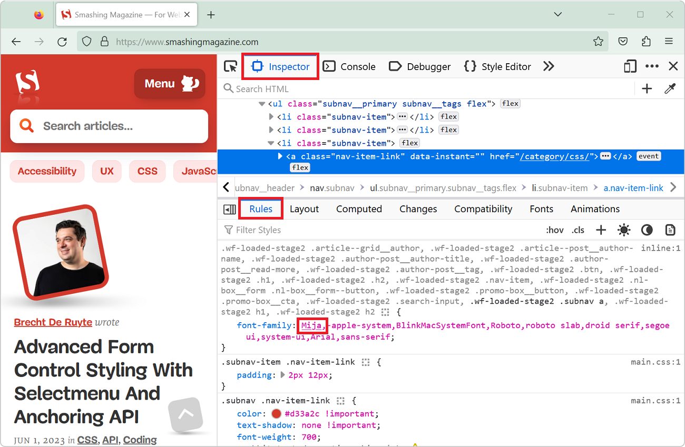

The CSS [`font-family`](https://developer.mozilla.org/docs/Web/CSS/font-family) property let's you define a comma-separated list of fonts that the browser engine should choose from (in priority order) to render text. For example, with `font-family: "Gill Sans", sans-serif;` the browser will first try to use the `Gill Sans` font, and if it's not available on the current device, it will fall back to whatever is the default `sans-serif` font on this device.

As a web developer, it's often useful to know which font was actually used in a long list of fallback fonts.

On Firefox:

1. Open DevTools, and open the **Inspector** tool.
1. Select the element you want to inspect.
1. In the **Rules** sidebar, find the `font-family` property that applies to this element.
1. Check which font name in the property value is underlined. This is the font the browser selected.

**Important note**: this is different from knowing which font was used to actually render text. To make this clearer, there are two levels to keep in mind:

1. The CSS defined font in the `font-family` property, which is the font(s) that you, the web author, want to use. This may contain actual font names or generic font names such as `serif` or `system-ui`.
1. The actual font face the browser used to render some text. This is the font file that the browser finally chose to render the text. This font file contains the actual glyphs displayed on the rendered web page.

The defined and rendered fonts may be different for a number of reasons:

* The defined font is not available on the system.
* The defined font is available, but doesn't contain all the glyphs required to render the text. In this case, the browser will fall back to another font that contains the missing glyphs.
* The defined font is a generic font name, such as `serif` or `system-ui`, which the browser will map to a specific font on the system.
* The defined font is something like `Arial`, and is available, but the text contains both normal, bold, and italic text, in which case the browser may use different font files to render the different styles.

If you want to know which final font was used to **render** a piece of text, see: [List the fonts used on a page, or an element](./list-used-fonts.md).
