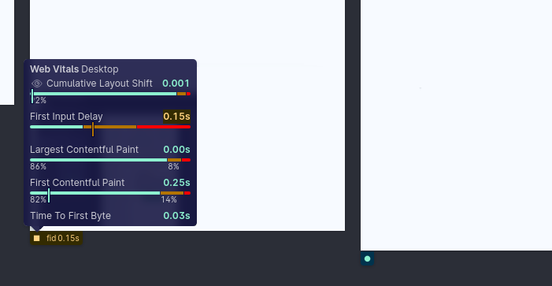

Web vitals are a set of metrics that help you determine how well-built your page is. You can [learn more about them here](https://web.dev/vitals/). These scores can be obtained with various online checks like [PageSpeed Insights](https://web.dev/measure/).

In Polypane you can show the current web vitals score of a page and compare it to global averages (CrUX data), as well as find out which parts of the page contribute to your scores.

To turn them on:
* Open the **Settings menu**
* Toggle **Web Vitals Status**
* Each pane now shows a small icon that will change from a circle to a square to a rectangle depending on your web vitals score.
* Hover the icon to show an overview:

In the overview you will find for each web vital the score for the current page and a bar chart of what percentage of visits were good, needed improvement or were bad. Click the **Eye icon** in front of a web vital, when available, will show which elements contributed to that score. [Learn more here](https://polypane.app/docs/web-vitals/).
