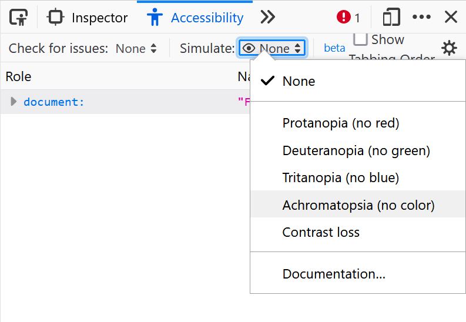
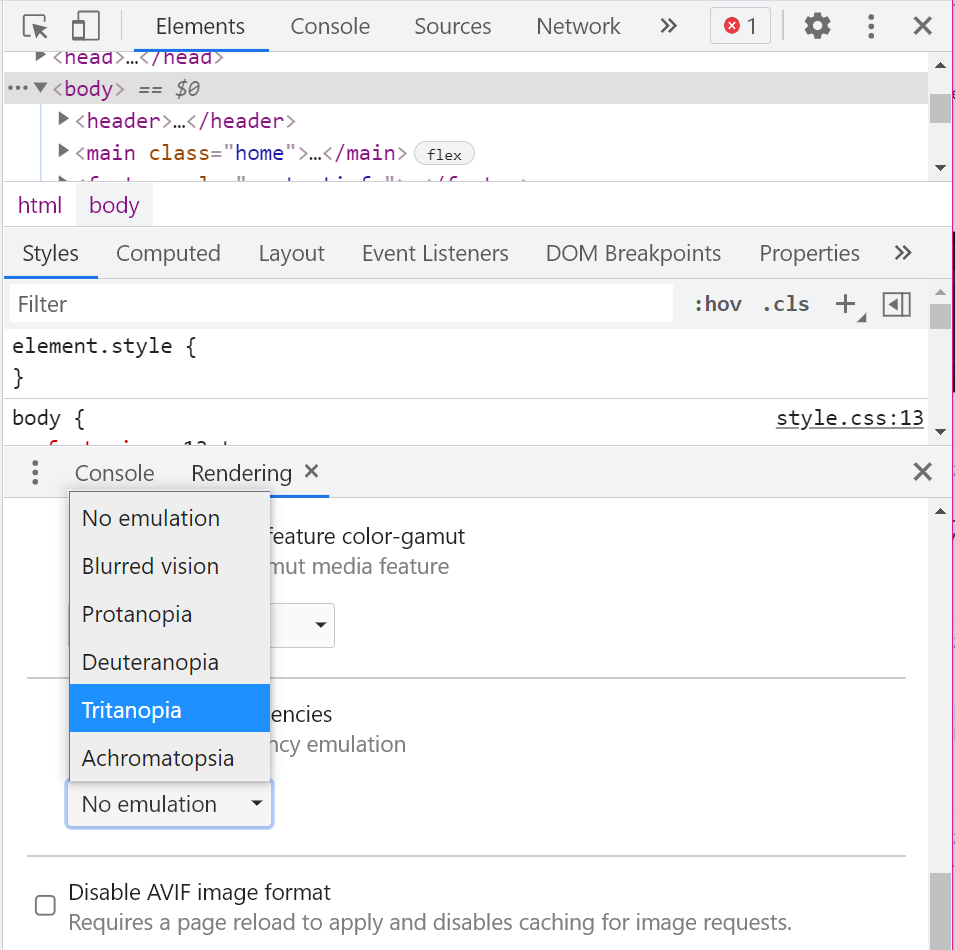
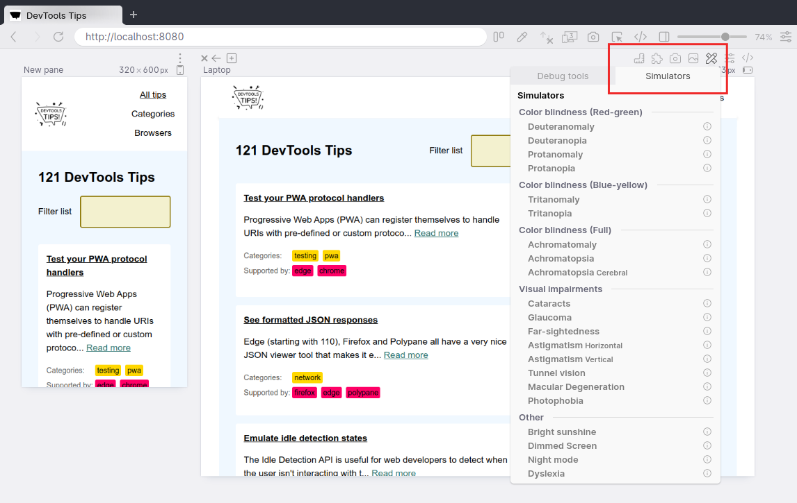

People who visit your web pages may have different types of color vision deficiencies that, if you incorrectly use colors for meaning, may affect their experience.

Firefox, Chrome, Polypane and Edge make it possible for you to test how a web page may appear to somebody with a color vision deficiency.

* In Firefox:
  * Go to the Accessibility panel
  * In the toolbar at the top, choose from a selection of different color vision deficiencies in the "Simulate" drop-down

* In Chrome, or in Edge:
  * You first need to open the Rendering panel. Either use the [command menu](./execute-commands.md) and type `rendering` or use the main menu (the three-dots icon in the top-right corner of the screen) and go to More Tools to find it.
  * Scroll down until you find the "Emulate vision deficiencies" section, and choose from the drop-down

* In Polypane:
  * Open the **Debug tools** option of a pane.
  * Switch to **Simulators**.
  * Select one of the nine available color vision simulators or hover over the "i" icon for additional information.

