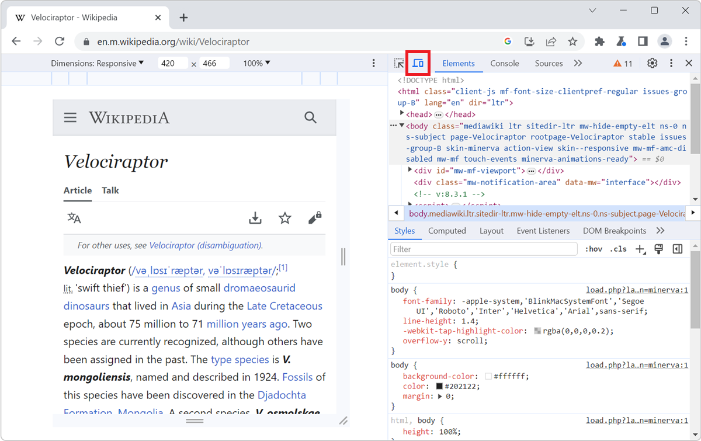
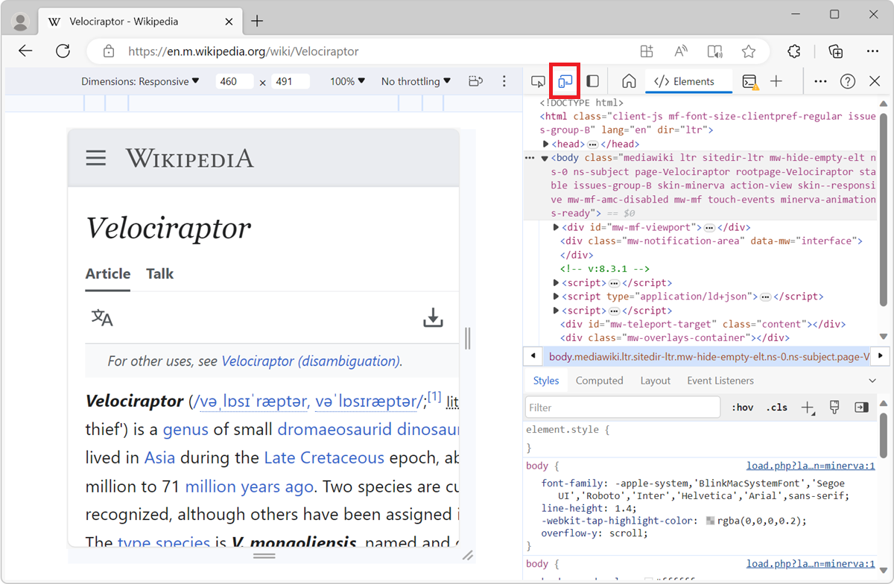
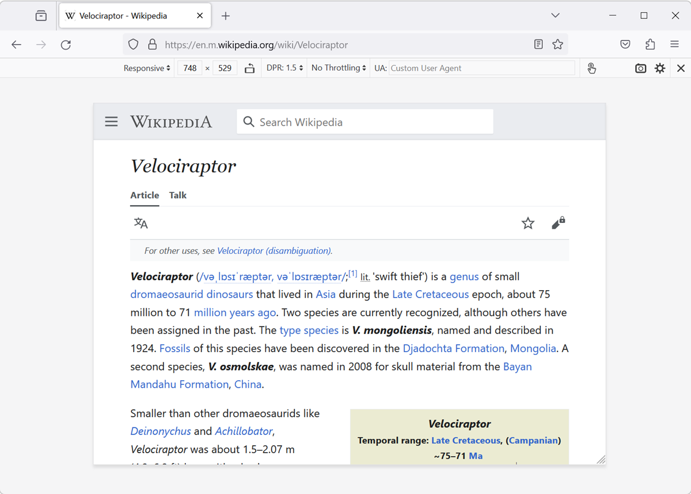

All browser DevTools have a built-in mode that you can use to test a webpage under different screen sizes and device capabilities.

As a web developer, it is very important to realize that your website won't only be used on one type of device. People browse the web with many different device types, from small phones, to large desktop monitors, and everything in between.

Not only do the devices people use have different screen sizes, but they can also have different pixel densities, support for touch input, network speeds, and more.

Browser DevTools make it easy to simulate how a webpage might render under different screen sizes and device capabilities. However, note that **this is only a simulation**, and you should always test your webpage on the real device too. For example, even if the device mode in Chrome DevTools lets you simulate an iPhone screen, it doesn't actually render the webpage with the same rendering engine as the iPhone would. So, always test on the real device too.

## Available features

This simulation mode comes with the following features (more might be available depending on the browser you're using):

* Resize the simulated viewport size by hand.
* Choose one of the pre-defined devices to simulate.
* [Create your own simulated devices](./add-new-devices.md).
* [Capture screenshots](./take-in-device-screenshots.md).
* [Throttle the network speed to test your website on slower connections](./throttle-network-speed.md).

## Start simulating

### In Chrome

To enable the device mode in Chrome DevTools, click the **Toggle Device Toolbar** button or press <kbd>Ctrl+Shift+M</kbd> (or <kbd>Cmd+Shift+M</kbd> on macOS).

### In Edge

To enable the device mode in Edge DevTools, click the **Toggle device emulation** button or press <kbd>Ctrl+Shift+M</kbd> (or <kbd>Cmd+Shift+M</kbd> on macOS).

### In Firefox

In Firefox, you don't need DevTools to be opened to simulate devices. Click **Open application menu** > **More tools** > **Responsive design mode**, or press <kbd>Ctrl+Shift+M</kbd> (or <kbd>Cmd+Shift+M</kbd> on macOS).

Or, if you're in DevTools, click the **Responsive Design Mode** button, or press <kbd>Ctrl+Shift+M</kbd> (or <kbd>Cmd+Shift+M</kbd> on macOS).

### In Safari

In Safari, you don't need DevTools to be opened to simulate devices. Click **Develop** in Safari's menu bar, and then click **Enter Responsive Design Mode**, or press <kbd>Ctrl+Command+R</kbd>.

If you aren't seeing the **Develop** menu item, enable it first (this only needs to be done once):

1. In Safari, in the menu bar, go to **Safari** > **Settings**.
1. Select the **Advanced** tab.
1. Click **Show features for web developers**.

### In Polypane

Simulating different screen sizes is Polypane's default behavior. Polypane is the only browser DevTools that allows you to see multiple screen sizes side by side too. To learn more, see [Simulate multiple devices that are kept in sync](./simulate-multiple-devices.md).

