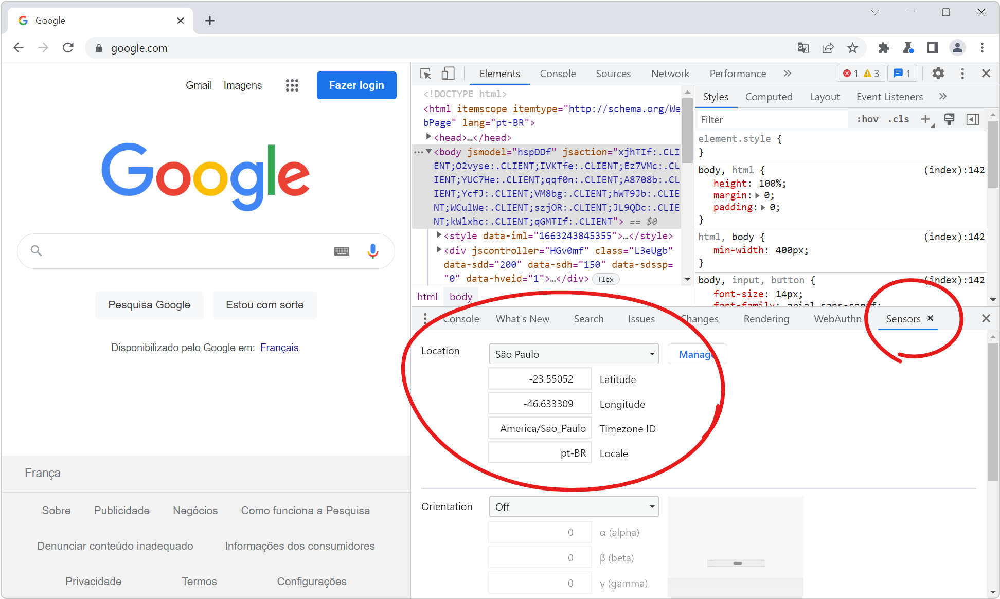

If your website has features that depend on the geographic location of your users, you can test these features by simulating different geolocations right from DevTools!

Chrome and Edge DevTools have a built-in way to simulate any location:

1. In DevTools, press <kbd>ctrl</kbd>+<kbd>shift</kbd>+<kbd>P</kbd> (or <kbd>cmd</kbd>+<kbd>shift</kbd>+<kbd>P</kbd> on mac) to open the [Command Menu](./execute-commands.md).
1. Type "Sensors" in the command menu and press <kbd>Enter</kbd>.
1. In the **Sensors** tool, find the **Location** drop-down.
1. Choose any of the preset locations (or create your own by clicking **Manage**) and refresh the webpage.

In the following screenshot, the webpage is google.com and the location was set to São Paulo, Brazil. After a refresh, the google.com homepage shows the text in Portuguese.

