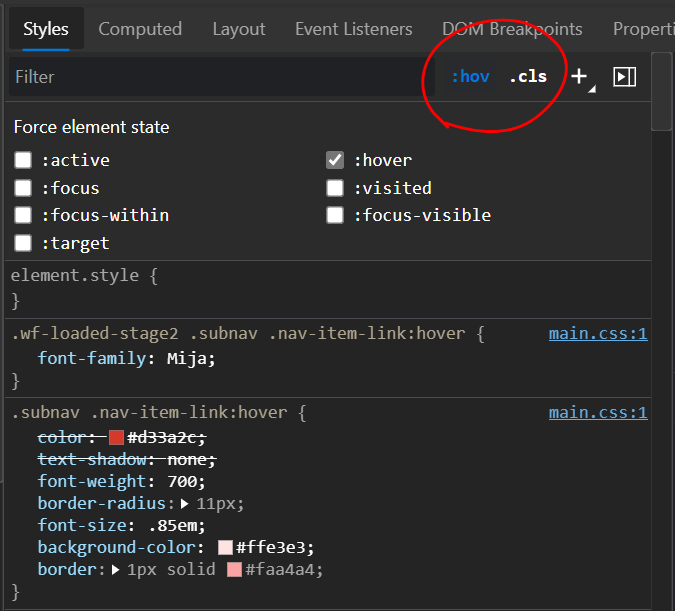

If you use `:hover`, `:active`, or other pseudo-classes in your CSS code, it can be tedious to test them. For example, having to hover over an element which is styled with the `:hover` pseudo-class means that you can't use your mouse to inspect the element in DevTools at the same time.

Thanks to DevTools, you can actually simulate these pseudo-classes without having to use your mouse or keyboard.

To simulate a pseudo-class:

1. Inspect an element that has a pseudo-class defined in your CSS code.

1. Depending on your browser, do either of the following:

   * In Chrome, Edge, or Safari: in the **Elements** tool, in the **Styles** sidebar, click the `:hov` button.
   * In Firefox: in the **Inspector** tool, in the **Rules** sidebar, click the `:hov` button.
   * In Polypane: in the **Elements** tool, click the rhombus icon.

   The pseudo-class section appears.

1. Select one, or more, pseudo-classes to simulate.

Here is a screencast showing how to use pseudo-class simulation to check the hover, active, visited and focused state of a link without having to interact with the link using your keyboard or mouse:

https://www.youtube.com/watch?v=CgHuHYRyvXc

To try it out yourself, [here is the demo page](https://codepen.io/codepo8/pen/WNEMaPO) used in the video.
