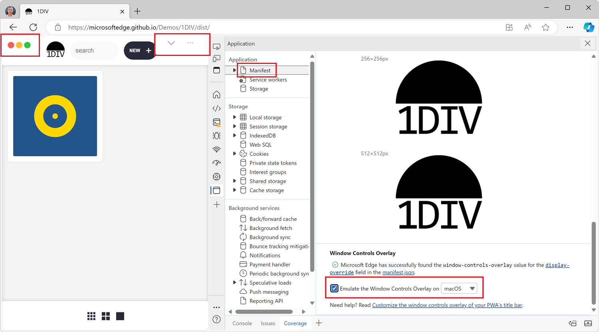

If you're building a desktop PWA, you might want to use the [Window Controls Overlay](https://developer.mozilla.org/docs/Web/API/Window_Controls_Overlay_API) (WCO) feature to make your app look more native. With WCO, you gain control over the entire surface area of the installed app window, and can display your own title bar.

The only difficulty is testing the feature. To test your new title bar when using WCO, you actually need to install the app on your device first, but also test what the app looks like on all operating systems (macOS, Windows, Linux) because the title bar will look different on each.

The **Application** tool in both Chrome and Edge let you simulate the WCO feature so that you don't have to leave the comfort of your browser and can test what your app will look like when installed on any OS.

To simulate WCO:

1. Open the PWA where you're using the WCO feature in Chrome or Edge.
1. Open DevTools and go to the **Application** tool.
1. Select the **Manifest** tab in the sidebar.
1. Scroll down to the **Window Controls Overlay** section, at the bottom of the panel.
1. Select the **Emulate the Window Controls Overlay** checkbox.
1. Select the operating system you want to simulate.

The OS-specific window controls will appear in the webpage, and your CSS code will work as if the `env(titlebar-area-*)` environment variables were set. To learn more about the CSS environment variables you can use with WCO, see [Using env() to ensure content is not obscured by window control buttons in desktop PWAs](https://developer.mozilla.org/docs/Web/CSS/env#using_env_to_ensure_content_is_not_obscured_by_window_control_buttons_in_desktop_pwas) on MDN.

