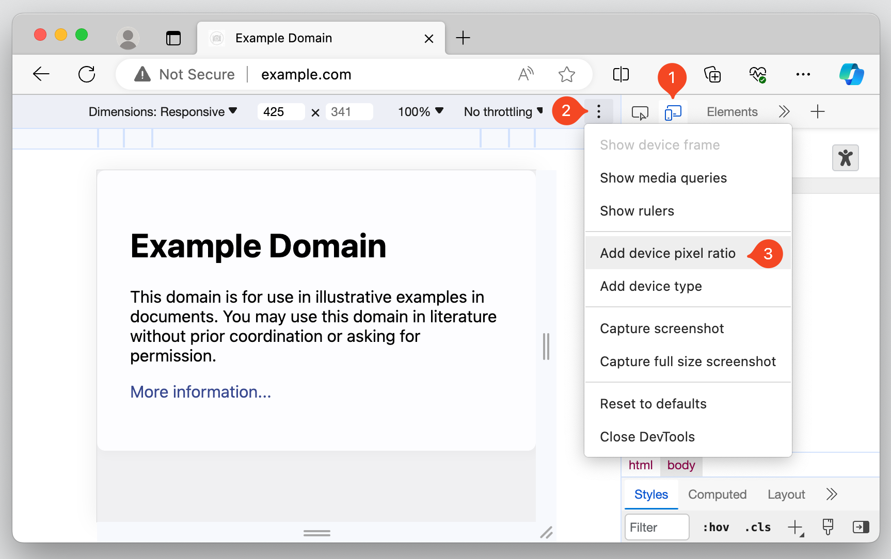
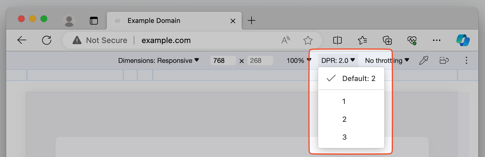

Taking screenshots of all or parts of web pages is super useful (scroll down to the *See Also* part at the bottom of this page for more tips on that). But sometimes, the resulting screenshots aren't high-resolution enough for your needs.

It turns you can make DevTools take high-resolution screenshots of your web pages too!

### From the Console in Firefox

Firefox has a super handy `:screenshot` command you can use in the **Console** tool to take screenshots. It takes a few options, including `--dpr` to specify the device pixel ratio. The default value is `1`, but you can set it to `2`, `3`, or any other number to take screenshots at higher resolutions.

For example: `:screenshot --dpr 3 --fullpage` will take a screenshot of the full page at three times the resolution.

Find out more about the `:screenshot` command and its other options in the [Firefox DevTools documentation](https://firefox-source-docs.mozilla.org/devtools-user/web_console/helpers/index.html).

### From Device Mode in Chromium-based browsers

Here's a nice trick to do a similar thing in Chromium-based browsers (Chrome, Edge, Brave, etc.):

1. Open DevTools and go to the **Device Mode** tool.
1. Click the **Dimensions** dropdown menu and select **Responsive**.
1. Click **More options** (`⋮`) and select **Add device pixel ratio**. This will add a new DPR dropdown to the device toolbar where you can select the DPR value.
1. In the DPR dropdown, select the highest value to take the highest resolution screenshot.
1. Click **More options** (the three dots icon) and then click **Capture full size screenshot**.

