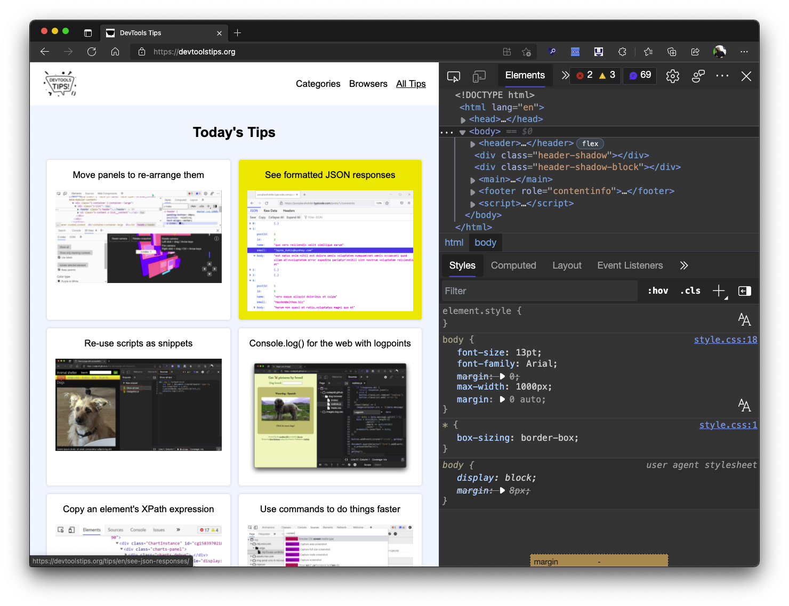
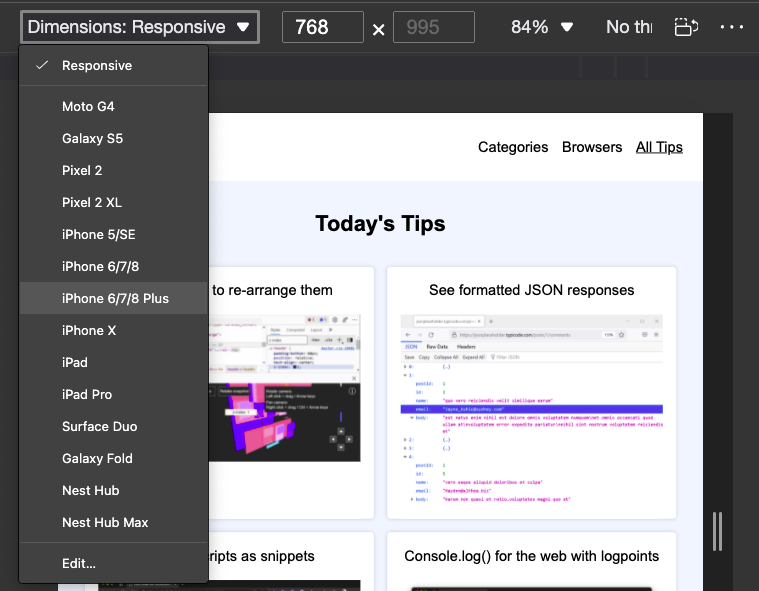
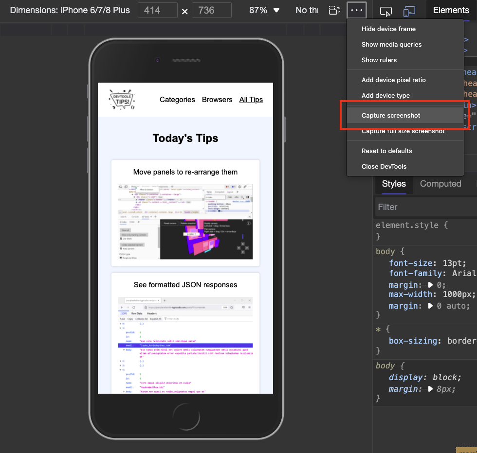

Taking a photo of a mobile device or tablet is daunting as you have to deal with fingerprints, glare and focus issues. Using Device Emulation makes this a lot easier.

1. Open any web product in your Chromium browser and Open Developer Tools with `Ctrl+Shift+I` (`CMD+Shift+I` on Mac) or `F12`.

    
1. Turn on Device emulation by clicking the icon or pressing `Ctrl+Shift+M` (`CMD+Shift+M` on Mac).

    
1. Select a device from the Device dropdown menu.
    
1. Go to the `More options` menu `…` and select `Show device frame` - be aware that not all devices have graphical frames.
    
1. If there is a frame, you can see your web product inside it.
1. Go to the `More options` menu `…` once more and select `Capture screenshot`
    

That's it, you now have a photo of your web product inside a device on transparent background.

You can see this in action in the following video:

https://www.youtube.com/watch?v=ZViLMjxpqEE