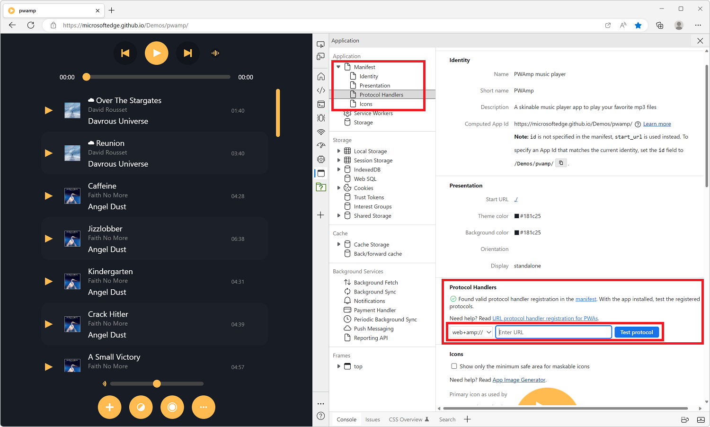

[Progressive Web Apps (PWA)](https://developer.mozilla.org/docs/Web/Progressive_web_apps) can register themselves to handle URIs with pre-defined or custom protocols (such as `mailto`, `geo`, or `web+foo`). This is a great capability that makes it possible for installed PWAs to feel more like real apps.

To learn more about how to register a PWA as a protocol handler, see [Handle protocols in Progressive Web Apps](https://learn.microsoft.com/microsoft-edge/progressive-web-apps-chromium/how-to/handle-protocols) or  [URL protocol handler registration for PWAs](https://developer.chrome.com/articles/url-protocol-handler/).

However, testing your protocol handlers can be difficult. Thankfully, DevTools in both Chrome and Edge, provide a nice little tool that makes it all a lot easier.

To test your handler:

* Make sure your PWA is installed first.
* Open your PWA in a browser tab, and open DevTools.
* Open the **Application** tool and then click **Manifest**.
* Scroll down to the **Protocol Handlers** section.

   If you see a green checkmark, that means your protocol handlers were detected correctly.

* Use the dropdown to select the protocol you want to test, and the textfield to type the rest of the URI.
* Click **Test protocol**.

   Your installed PWA should now be launched automatically, and you can test your protocol handling code.

