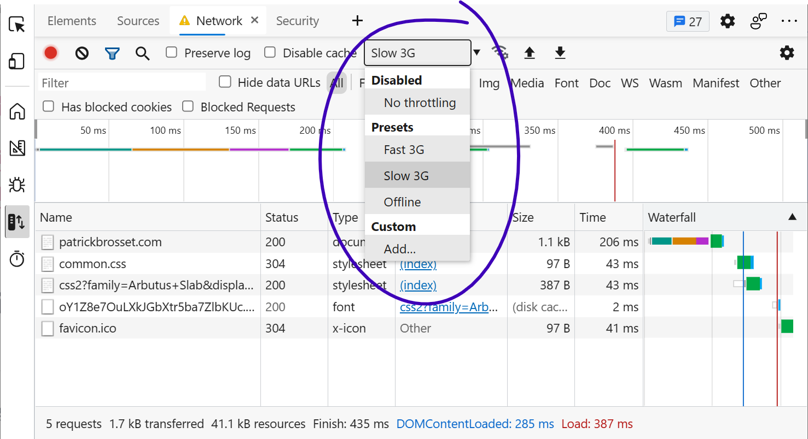

While you may develop your website on a fast network connection at home or at work, your users may not be able to use it with an equally fast connection. Perhaps they're in a moving car, or on the subway, or they don't have access to high-speed internet at their place. Whatever it is, they may experience your site very differently than you do because of this.

Testing your site with a slower connection helps you understand how it loads and appears on the screen.

Firefox, Chrome and Edge let you simulate slower network connections to do this.

To throttle your connection:

* Go to the **Network** tool.
* Use the dropdown that says `No throttling` and choose any of the other values.

You can also do this from the [device simulation](./simulate-devices.md) mode by using the same dropdown there.

In Polypane:

* Open the **Emulation options**.
* Go to the **Network** tab.
* Toggle between the different network speed settings

