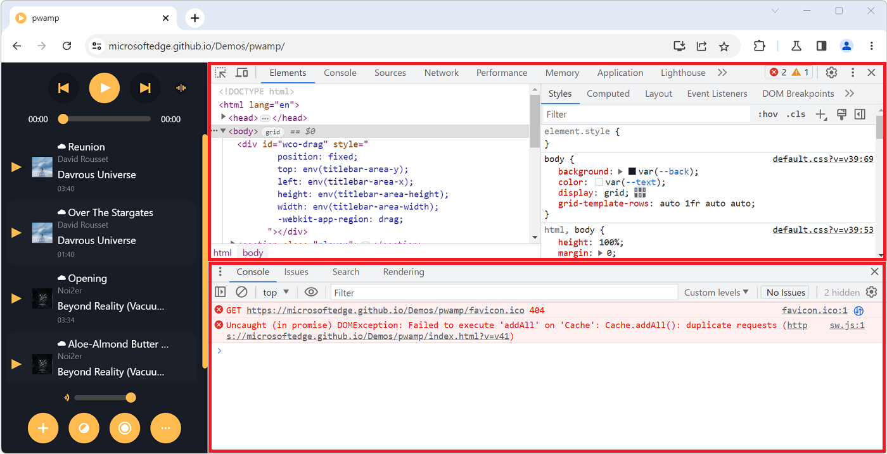
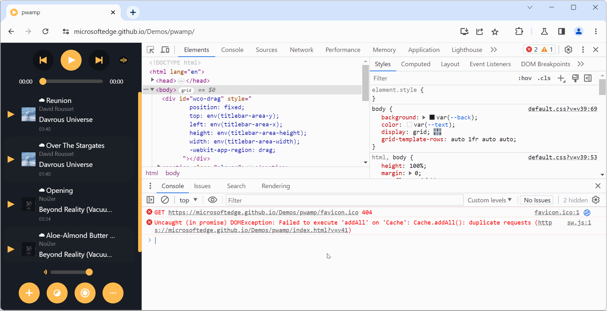

Have you noticed how the **Console** tool is sometimes displayed in a top-level tab (just like all other tools), and sometimes in a split pane at the bottom, below the main tool?

If you've been confused by this in the past, this tip should hopefully help you understand the logic behind it.

## The main panel vs. the drawer

All browser DevTools have a main area, let's call it the main panel, and typically display their tools as tabs in this main panel.

But they also also have a bottom area called the **drawer**.

This area is not always displayed and can be toggled by pressing the <kbd>Escape</kbd> on your keyboard. If you don't see the drawer, press <kbd>Escape</kbd> and it should appear, therefore splitting the DevTools window into 2 parts: 

1. The main area at the top, that contains all of your tools.
1. The drawer area at the bottom, where other tools can be used too.

Here is what DevTools looks like, when the drawer isn't displayed:

After pressing <kbd>Escape</kbd>, here is what DevTools looks like, with the drawer at the bottom:

## What's in the drawer?

In Firefox, the drawer only contains the **Console** tool. So, whenever you feel the need to see your logs, or execute a bit of JavaScript code while working with another tool, just press <kbd>Escape</kbd>.

In Chrome or Edge, the drawer has its own tabbar, just like the main panel, which can contain the **Console**, but can also be used to open other tools too.

## What if you open the Console in the main panel?

This is where things may be confusing: what if you open the drawer to display the **Console** and then you also open the **Console** in the main panel?

When you do this, the drawer hides itself automatically. This happens because there is only one instance of the **Console** tool in DevTools. Whether it's displayed in the main panel or in the drawer makes no difference, it's the same tool that's used.

So, remember, if you select the **Console** in the main panel when it's already displayed in the drawer, the drawer hides away, only to return once you switch over to a different tool.

