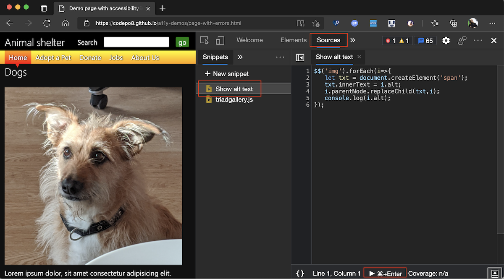

The [Console](https://docs.microsoft.com/microsoft-edge/devtools-guide-chromium/console/) of DevTools is a great way to write some JavaScript to read information from the document or manipulate it. The problem is that the Console is a terrible editor. 

That's why there is the [Sources](https://docs.microsoft.com/microsoft-edge/devtools-guide-chromium/sources/) tool in DevTools that is a full editor. You can use this editor to write more complex scripts to run in the context of the document open in the browser and keep them for later re-use.

These are called [Snippets](https://docs.microsoft.com/microsoft-edge/devtools-guide-chromium/javascript/snippets) and you can access them in the Sources tool on the left hand side (you may have to use the >> to reach them). You can create as many named snippets as you like and remove ones you don't need any more. 

Snippets have full access to the window object and you can use any of the convenience methods of the [Console Utilities API](https://docs.microsoft.com/microsoft-edge/devtools-guide-chromium/console/utilities) in it. For example, this script would replace each image in the document with its alternative text:

```JavaScript 
$$('img').forEach(i=>{
   let txt = document.createElement('span');
   txt.innerText = i.alt;
   i.parentNode.replaceChild(txt,i);
   console.log(i.alt); 
});
```
You can run Snippets by pressing `ctrl + enter` (or `CMD + enter` on mac) or using the button on the bottom of the editor.



Even better, you can use the [Command Menu](https://docs.microsoft.com/microsoft-edge/devtools-guide-chromium/command-menu/) to run Snippets in any context of the Developer Tools. Simply press `ctrl + p` (or `CMD + p` on mac) and type `!` followed by the name of your Snippet. You get an autocomplete menu to choose the Snippet and you run it by hitting `Enter`.


