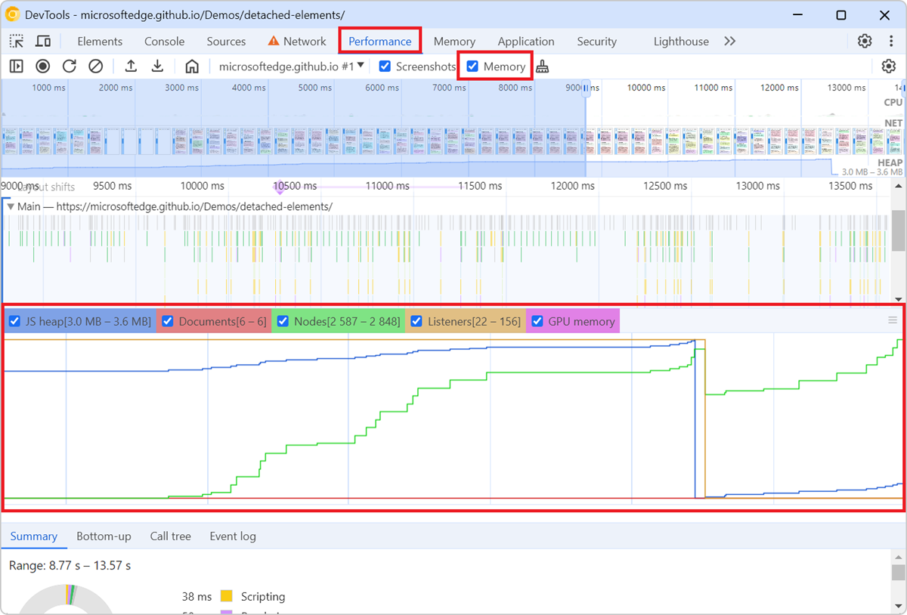

To check how much memory a webpage consumes over the time of a specific user scenario, and to identify potential memory leaks, you can use the **Memory** tool in Chrome or Edge DevTools with the **Memory** option.

1. Open DevTools and go to the **Performance** tool.

1. In the toolbar, enable the **Memory** option.

1. Click **Record** to start the recording.

1. Interact with the page like a user would, to simulate the user scenario you want to analyze.

1. Click **Stop** to end the recording.

   Once the resulting profile appears in the tool, a memory graph is displayed below the main flame chart area.
   
The memory graph shows the memory usage of the page over the time of the recording. For example, you can see how the JS heap memory (i.e, the memory region where all the JavaScript objects live) usage evolves when new objects get created (the blue line goes up) and then get garbage collected (sudden drops on the blue line).

