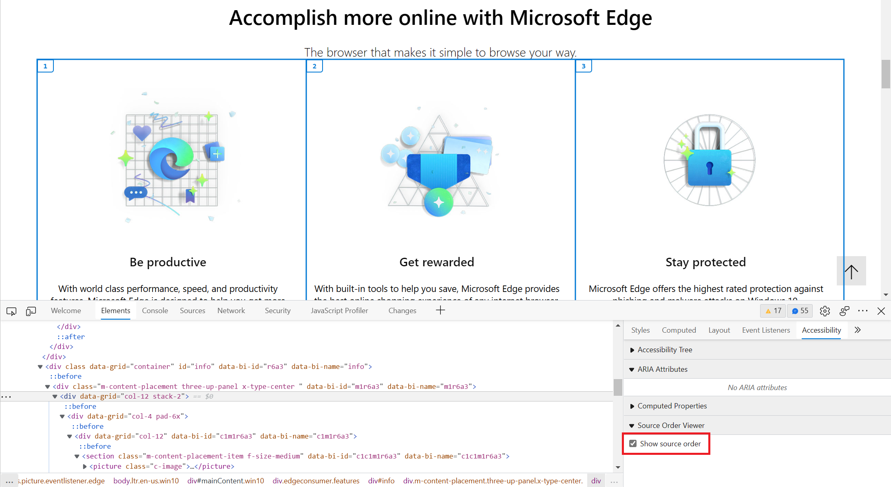

Some users make use of assistive technology, like screen readers (e.g. Narrator, VoiceOver, NVDA), to consume the content of web pages and interact with them. If a screen reader presents the content in an incorrect order, such as presenting the content of a section before its title, this might give users a confusing experience.

Incorrect ordering can occur if you use CSS to reorder elements visually in a way that is not reflected in the source order. To learn more, see [HTML Source Order vs CSS Display Order](https://adrianroselli.com/2015/10/html-source-order-vs-css-display-order.html).

You should ensure that the source order matches the display order, and you can use DevTools to check.

## In Edge and Chrome

1. Open the **Elements** tool.

1. Select the DOM element for which you want to check the source order.

1. Open the **Accessibility** tab in the tool's sidebar.

1. Under the **Source Order Viewer** section, click **Show source order**.

   An overlay appears on the page, and shows the order in which elements appear in the source

## In Safari

The **Elements** tool in Safari Web Inspector allows you to visualize the source order for flexbox containers.

1. Open the **Elements** tool.

1. Open the **Layout** tab in the sidebar.

1. Under **Flexbox**, select the **Order Numbers** checkbox.

1. Below, find the flexbox container for which you want to visualize the source order and select the checkbox.

   An overlay apppears on the page, showing lines around the flexbox container, the flexbox items, and labels indicating the source order of flexbox items.

